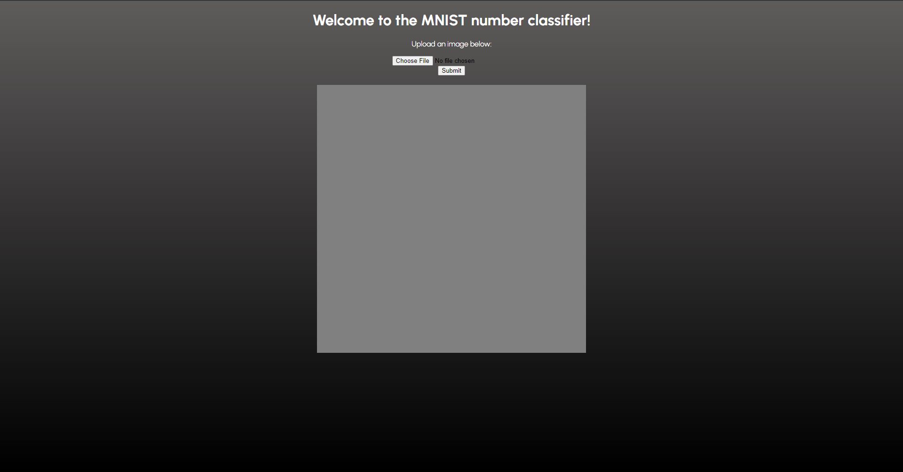
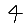
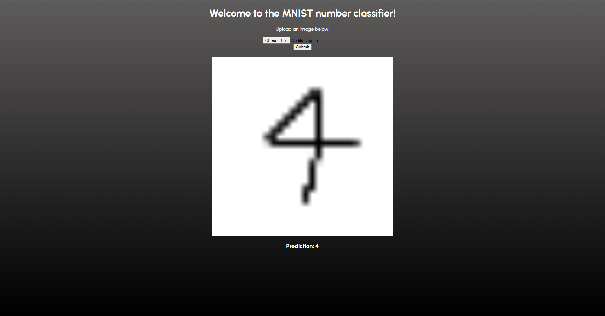

# MNIST Webapp

This project consists of a simple Flask webapp that allows users to upload 28x28 images containing a single digit (0-9) and then returns a prediction for what digit the image contains. 

This is what the website looks when you first open it. Click "Choose File" in order to choose an image to test, and click "Submit" in order to receive a prediction.

As an example, let's test the following 28x28 image:

It is important to use an image with a black number and white background, otherwise you will have to change the preprocessing steps such that the image colors are not reversed, since the MNIST dataset uses white numbers on a black background.

Here is the prediction from the website:

## Tech Used
I used Flask, HTML, and CSS in order to implement all of the front-end functionality, including image uploading/downloading as well as displaying the image. For the back-end, I used Pytorch to train a shallow CNN on the MNIST dataset. I found that training on my CPU took ~30 seconds and yielded about 99% test accuracy, but I've also saved my model as a .pt file so you will not need to retrain it on your own end.

## Credit
Aladdin Persson's video tutorials on YouTube were highly instructive and helped me code and understand the CNN I used in this project. His original code can be found [here](https://github.com/aladdinpersson/Machine-Learning-Collection/tree/master).